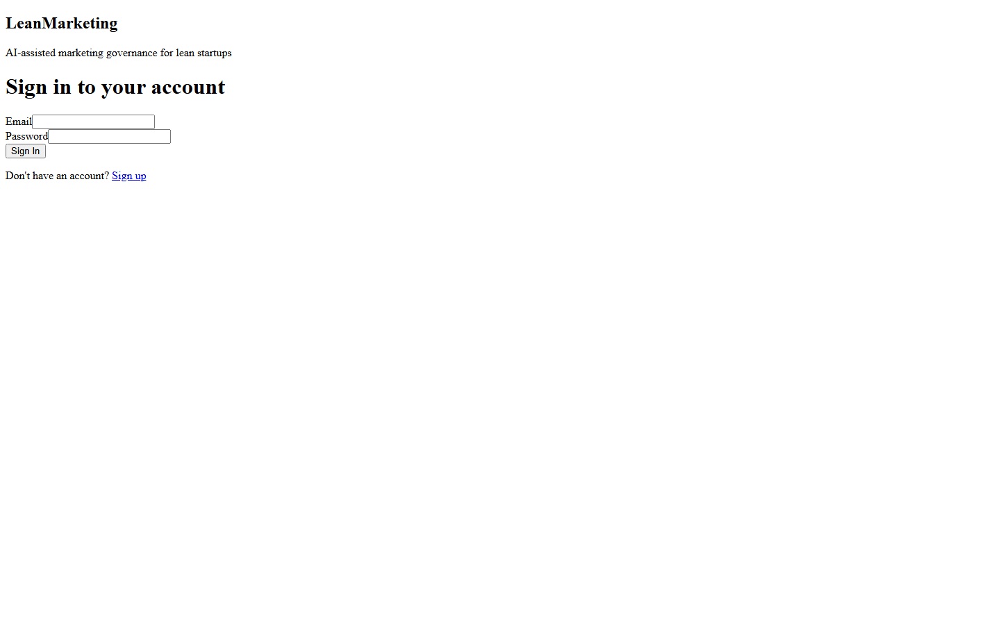
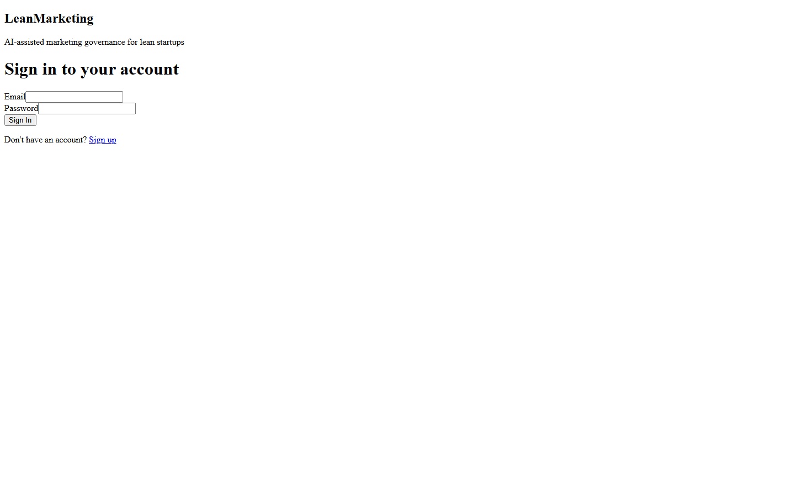

# /

**Section:** Public Pages

## Light Mode

**HTTP Status:** 200

**Purpose:** This page serves as the login interface for the LeanMarketing application, allowing existing users to access their accounts by entering their email and password. It is intended for users who need to manage AI-assisted marketing governance for lean startups.

**Key Elements:**
- Application title text: 'LeanMarketing'
- Application slogan text: 'AI-assisted marketing governance for lean startups'
- Page title text: 'Sign in to your account'
- Text label: 'Email'
- Text input field for email
- Text label: 'Password'
- Text input field for password
- Button: 'Sign In'
- Informational text: 'Don't have an account?'
- Text link: 'Sign up'

**Data Shown:**
- Application name: LeanMarketing
- Application description/slogan
- Instructions for signing in
- Labels for email and password input fields
- Prompt for new users to sign up

**User Interactions:**
- User can type into the 'Email' input field
- User can type into the 'Password' input field
- User can click the 'Sign In' button to submit login credentials
- User can click the 'Sign up' link to navigate to a registration page

**Navigation:**
- To the main application dashboard or home page (after successful 'Sign In')
- To a 'Sign up' or registration page (via the 'Sign up' link)

**Issues Found:**
- No visual issues such as broken layout, cut-off text, or contrast problems are apparent in the screenshot.

**Accessibility:** Labels for input fields ('Email', 'Password') are clearly visible and appear to be associated with their respective fields. Text contrast against the white background seems sufficient. Focus indicators are not visible in a static image but would be crucial for keyboard navigation.

## Dark Mode

**HTTP Status:** 200

**Purpose:** This page serves as the login interface for the LeanMarketing application, allowing existing users to access their accounts by providing their email and password.

**Key Elements:**
- Header text: 'LeanMarketing'
- Descriptive text: 'AI-assisted marketing governance for lean startups'
- Page title: 'Sign in to your account'
- Label: 'Email'
- Text input field for Email
- Label: 'Password'
- Text input field for Password
- Button: 'Sign In'
- Text: 'Don't have an account?'
- Link: 'Sign up'

**Data Shown:**
- Application name: 'LeanMarketing'
- Application tagline: 'AI-assisted marketing governance for lean startups'
- Login prompt: 'Sign in to your account'
- Form field labels: 'Email', 'Password'
- Call to action for login: 'Sign In'
- Prompt for new users: 'Don't have an account?'
- Link text for registration: 'Sign up'

**User Interactions:**
- User can type text into the 'Email' input field
- User can type text into the 'Password' input field
- User can click the 'Sign In' button to submit login credentials
- User can click the 'Sign up' link to navigate to a registration page

**Navigation:**
- To the LeanMarketing dashboard or home page (upon successful 'Sign In')
- To a 'Sign up' or registration page (via the 'Sign up' link)

**Issues Found:**
- The prompt specified 'dark mode', but the provided image displays a light mode interface. No other visual issues like broken layout or cut-off text are apparent.

**Accessibility:** Text and background contrast appears sufficient for readability. Input fields are clearly labeled ('Email', 'Password'). Focus indicators cannot be assessed from a static image.

---
*Generated: 2026-03-03T19:25:12.220Z*
