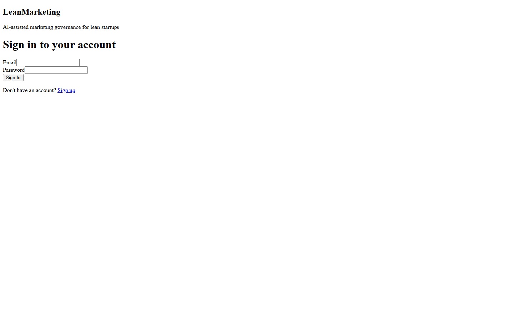
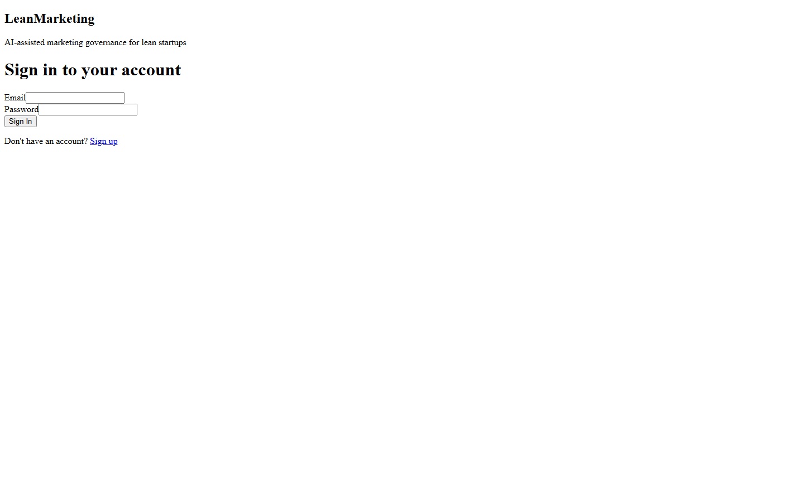

# /login

**Section:** Public Pages

## Light Mode

**HTTP Status:** 200

**Purpose:** This page serves as the login interface for the LeanMarketing application, allowing existing users to access their accounts by entering their email and password. It is intended for registered users of the AI-assisted marketing governance platform.

**Key Elements:**
- Header text: "LeanMarketing"
- Slogan text: "AI-assisted marketing governance for lean startups"
- Page title: "Sign in to your account"
- Label: "Email"
- Text input field for email
- Label: "Password"
- Text input field for password
- Button: "Sign In"
- Text: "Don't have an account?"
- Link: "Sign up"

**Data Shown:**
- Application name: "LeanMarketing"
- Application slogan: "AI-assisted marketing governance for lean startups"
- Login form labels: "Email", "Password"
- Prompt for new users: "Don't have an account? Sign up"

**User Interactions:**
- User can type into the 'Email' text input field.
- User can type into the 'Password' text input field.
- User can click the 'Sign In' button to submit login credentials.
- User can click the 'Sign up' link to navigate to the registration page.

**Navigation:**
- To the registration/sign-up page via the 'Sign up' link.

**Issues Found:**
- The styling of the input fields and the 'Sign In' button appears very basic, lacking modern UI design elements.
- There are no visible indicators for input validation or error messages on the form.

**Accessibility:** Labels are clearly associated with their respective input fields ('Email', 'Password'). Text contrast (black on white) is generally good. The 'Sign up' link is visually distinct with blue text and an underline, indicating its interactive nature.

## Dark Mode

**HTTP Status:** 200

**Purpose:** This page serves as the login interface for the LeanMarketing application, allowing existing users to access their accounts by entering their credentials.

**Key Elements:**
- Header text: LeanMarketing
- Subheader text: AI-assisted marketing governance for lean startups
- Page title: Sign in to your account
- Label: Email
- Input field for Email
- Label: Password
- Input field for Password
- Button: Sign In
- Text: Don't have an account?
- Link: Sign up

**Data Shown:**
- Application name: LeanMarketing
- Application tagline: AI-assisted marketing governance for lean startups
- Login prompt: Sign in to your account
- Input field labels: Email, Password
- Action button text: Sign In
- Account creation prompt: Don't have an account?
- Account creation link text: Sign up

**User Interactions:**
- Users can type text into the 'Email' input field.
- Users can type text into the 'Password' input field.
- Users can click the 'Sign In' button to attempt to log in.
- Users can click the 'Sign up' link to navigate to an account registration page.

**Navigation:**
- The user can navigate to a 'Sign up' page by clicking the 'Sign up' link.

**Issues Found:**
- The request specified 'dark mode', but the provided image displays a light mode theme with black text on a white background. No other visual issues like broken layout or cut-off text are apparent.

**Accessibility:** The contrast between the black text and white background is high, ensuring good readability. Input fields have visible borders, indicating their interactive nature. It is not possible to assess focus indicators or ARIA labels from the static image.

---
*Generated: 2026-03-03T19:25:12.220Z*
