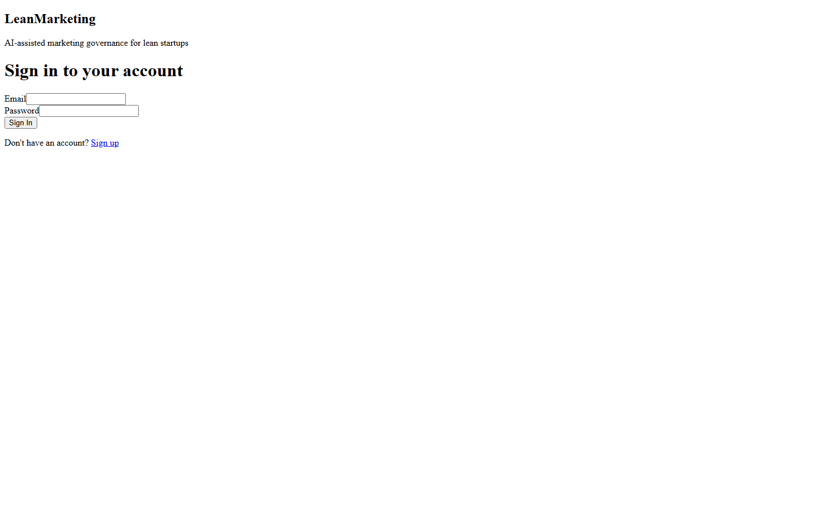
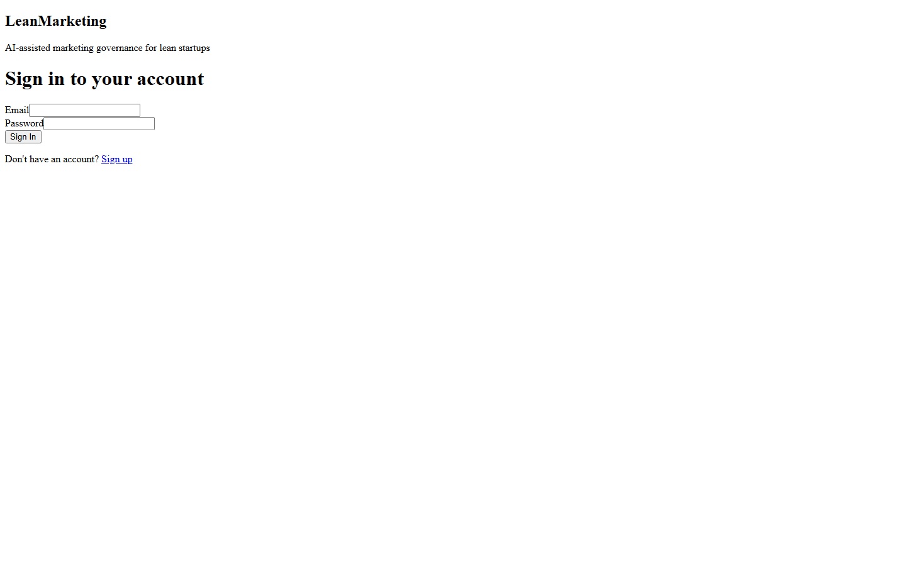

# /pricing

**Section:** Public Pages

## Light Mode

**HTTP Status:** 200

**Purpose:** This page serves as a login portal for users to access their LeanMarketing account by providing their email and password. It is intended for existing users of the AI-assisted marketing governance platform.

**Key Elements:**
- Header text: "LeanMarketing"
- Sub-header text: "AI-assisted marketing governance for lean startups"
- Main title: "Sign in to your account"
- Label: "Email"
- Text input field (for Email)
- Label: "Password"
- Text input field (for Password)
- Button: "Sign In"
- Text: "Don't have an account?"
- Link: "Sign up"

**Data Shown:**
- Application name: "LeanMarketing"
- Application tagline: "AI-assisted marketing governance for lean startups"
- Page title: "Sign in to your account"
- Form field labels: "Email", "Password"
- Action button text: "Sign In"
- Account creation prompt: "Don't have an account? Sign up"

**User Interactions:**
- User can input text into the 'Email' field.
- User can input text into the 'Password' field.
- User can click the 'Sign In' button to submit credentials.
- User can click the 'Sign up' link to navigate to an account registration page.

**Navigation:**
- User can navigate to a 'Sign up' page via the 'Sign up' link.

**Issues Found:**
- The text input fields for Email and Password appear visually narrow, which might limit the visible length of entered text.
- The 'Sign In' button has a default browser-like styling, which may not be consistent with a custom design system.

**Accessibility:** Labels are clearly associated with their respective input fields. The text contrast (black on white) is generally good for readability. Focus indicators are not visible in a static image, but interactive elements are present.

## Dark Mode

**HTTP Status:** 200

**Purpose:** This page serves as a login portal for users to access their accounts on the LeanMarketing platform. It is used by existing users to sign in.

**Key Elements:**
- Header text: 'LeanMarketing'
- Sub-header text: 'AI-assisted marketing governance for lean startups'
- Page title: 'Sign in to your account'
- Label: 'Email'
- Text input field for Email
- Label: 'Password'
- Text input field for Password
- Button: 'Sign In'
- Text: 'Don't have an account?'
- Link: 'Sign up'

**Data Shown:**
- Application name: 'LeanMarketing'
- Application description: 'AI-assisted marketing governance for lean startups'
- Login prompt: 'Sign in to your account'
- Input labels for 'Email' and 'Password'
- Call to action for new users: 'Don't have an account? Sign up'

**User Interactions:**
- User can type into the 'Email' text input field
- User can type into the 'Password' text input field
- User can click the 'Sign In' button to submit credentials
- User can click the 'Sign up' link to navigate to a registration page

**Navigation:**
- User can navigate to a 'Sign up' (registration) page

**Issues Found:**
- None visible. The layout appears clean and functional, and all text is legible.

**Accessibility:** Input fields have clear labels ('Email', 'Password'). The 'Sign In' button is clearly identifiable. The 'Sign up' link is visually distinct. Contrast for text on the white background is good.

---
*Generated: 2026-03-03T19:25:12.221Z*
